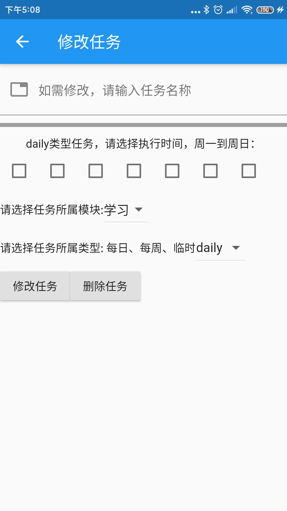
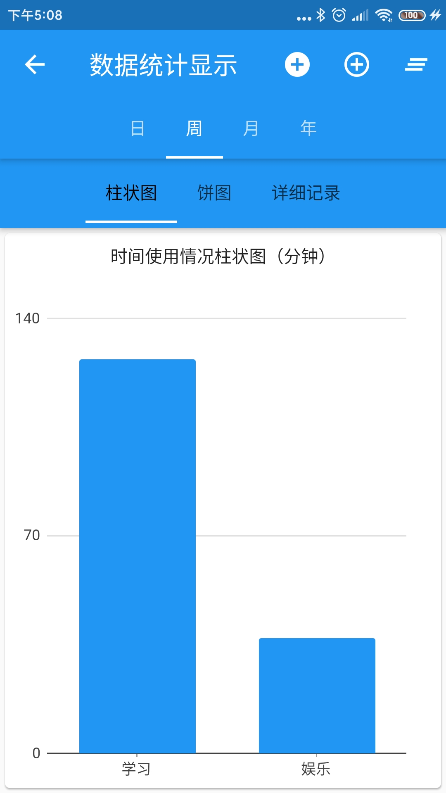
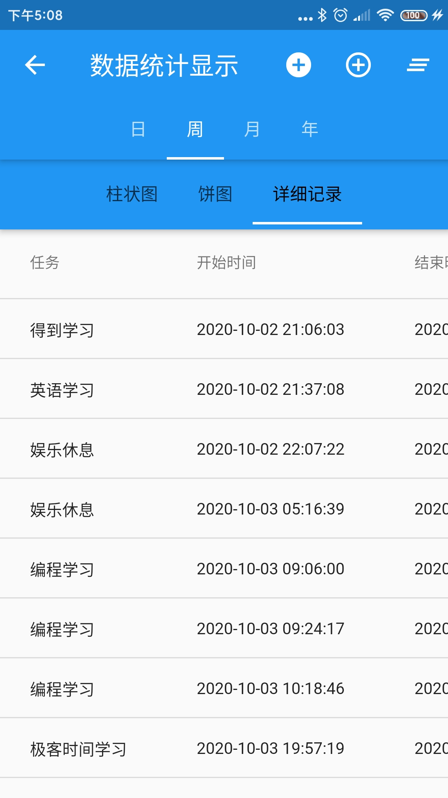

# 目标打卡APP
***
*一个日常事务打卡和统计的APP，用于日常任务记录、任务所需时间记录、任务花费时间统计显示*

## 开发由来
&ensp;&ensp;&ensp;&ensp;在学习的工程中，想用APP
将其记录下面，每日或每周重复打卡记录，类似于列清单。用手机软件就比较方便，但市面上的那些软件都没有符合我的需求的，有的还要付费......

&ensp;&ensp;&ensp;&ensp;感觉这种东西写起来应该不难，就学习用flutter写了一个。

&ensp;&ensp;&ensp;&ensp;注意的功能就是可以无限制列任务清单、记录任务进行的所用时间，后面并对所有时间进行了图标展示，便于了解时间上的效率情况

## 界面
&ensp;&ensp;&ensp;&ensp;基本界面如下：

### 任务列表展示界面
&ensp;&ensp;&ensp;&ensp;展示任务列表，右上角分别是统计详情按钮和任务添加按钮


### 任务信息展示界面
&ensp;&ensp;&ensp;&ensp;任务信息页面，这里可以对现有的任务进行修改和删除



### 任务花费时间统计（饼图、柱状图、详情记录）
&ensp;&ensp;&ensp;&ensp;任务花费时间统计显示，右上角分别是人工录入记录按钮（第一个是任务列表中不存在的任务，用于记录临时的一次性任务，第二个是已有任务的记录添加），第三按钮是记录情况按钮，慎用！





## 数据结构相关（目前版本先采用本地存储)
### 本地存储数据格式
#### 打卡任务属性定义:taskProperty.log
&ensp;&ensp;&ensp;&ensp;用map-list-map三层结构进行存储，一层map区分任务类型，二层list放任务数组，三层放任务定义

```json
{
  "daily":[
            {
              "name": "任务名称",
              "cycleTime": [false, false, false, false, false, false, false], //每日任务执行时间，周1（数组元素0）为true
              "moduleId": "所属模块名称",
              "lastComplete": "最后完成日期",
              "isComplete": "当天是否完成",
              "type": "任务类型，每日daily，每周week，临时temp"
            }
          ],
  "week": .......,
  "temp": .......,
}

```

#### 任务统计：taskStatistics.log
&ensp;&ensp;&ensp;&ensp;用map-list两层结构进行存储，一层map使用当天年月日作为key，用于存储当天产生的统计记录，后期便于查询统计操作

```json
{
  "日期": [
    {"taskName": "任务名称", "moduleName": "模块名称", "second":  "秒", "begin": "任务开始时间", "end": "任务结束时间"}
  ]
}
```

## 本地编译与安装使用
&ensp;&ensp;&ensp;&ensp;程序在Android Studio运行后，在 build/app/outputs/apt/release/app.apk，传到手机上安装即可：

- 停留在程序入口文件处（Main）
- 上方菜单栏：Build/Flutter/Build APK
- 等待运行完成即可

## 代码结构说明
```markdown
- lib // 所有的源码都在这个目录下
    - model // 放置基本数据模型（方法和属性）
    - tools // 这里主要放置数据持有单例、任务时间花费统计操作类、任务计时类
    - view // 这里放置页面视图
    - main.dart
```

## 发布日志
- 2020.10.4：V1.0.0版本完成，主要功能如下
    - 任务新增、查看、修改、删除
    - 任务计时、自定义计时（计时时软件突然退出的补救）
    - 任务用时柱状图、饼图、详情查看
    
## 下个可能的需求开发
- 任务提醒功能：没一个小时提醒 / 定点提醒
- 删除任务时提示确认/必要操作的提示确认
- 在任务模块下有开始计时和结束计时功能，新增提示休息功能，如工作45，休息5（可自定义）统计累计耗时
- 可以新增任务模块

## 错误与修复
- Failed to install the following Android SDK packages as some licences have not been accepted.
    - 使用命令：flutter doctor --android-licenses

## 参考链接
- [在中国网络环境下使用 Flutter](https://flutter.cn/community/china)
- [中文社区网站：外网翻墙也经常挂](https://flutter.cn/docs/reference/widgets)
- [官方教程](https://flutterchina.club/setup-windows/#%E8%8E%B7%E5%8F%96flutter-sdk)
- 安装依赖：点击链接进入依赖组件官网，选择Installing，里面有完整的安装语句
- 界面刷新（重绘）：调用有状态主键setState函数
- [Flutter 中的单例模式](https://juejin.im/post/5c83d5ac5188257de66337a9)
- [导航到一个新页面和返回](https://flutter.cn/docs/cookbook/navigation/navigation-basics)
- [3.7 输入框及表单](https://book.flutterchina.club/chapter3/input_and_form.html)
- [Flutter：界面刷新和生命周期](https://juejin.im/post/5ca81c80e51d4509f8232e9b)
- [读写文件](https://flutterchina.club/reading-writing-files/)
- [给新页面传值](https://flutterchina.club/cookbook/navigation/passing-data/)
- [Placing two trailing icons in ListTile](https://stackoverflow.com/questions/54548853/placing-two-trailing-icons-in-listtile)
- [Tips to use Timer in Dart and Flutter](https://fluttermaster.com/tips-to-use-timer-in-dart-and-flutter/)
- [Flutter widget index](https://flutter.dev/docs/reference/widgets)
- [表单：Form class](https://api.flutter.dev/flutter/widgets/Form-class.html)
- [文本：Text class](https://api.flutter.dev/flutter/widgets/Text-class.html)
- [单选：Radio<T> class](https://api.flutter.dev/flutter/material/Radio-class.html)
- [图表绘制](https://google.github.io/charts/flutter/gallery.html)
- [Flutter 常用按钮总结](https://www.jianshu.com/p/e1b79b118914)
- [Flutter布局总结（二）：垂直或水平放置多个widget](https://blog.csdn.net/Super_666/article/details/81334895)
- [Flutter下拉菜单DropdownButton](https://www.jianshu.com/p/cba2171bcf30)
- [Flutter 日期时间选择类控件及国际化](https://cloud.tencent.com/developer/article/1599239)
