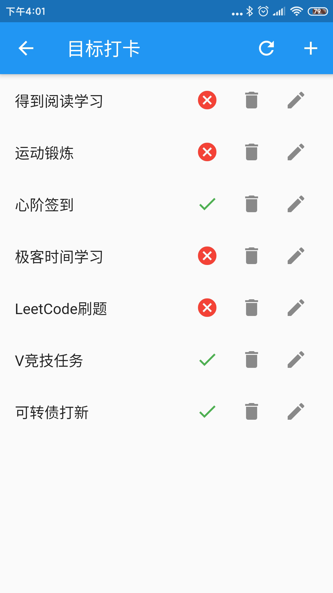

# 目标打卡APP
***
*flutter学习试手，顺便记录下过程中的问题和感悟*

*花了两天时间写了个大概，接下来边用边改吧*

## 界面
&ensp;&ensp;&ensp;&ensp;基本界面如下：



## 基本功能
### 已完成
- 任务新增：完成
- 任务修改：完成
- 任务显示：完成
- 任务打卡：完成
- 任务日志显示：完成
- 任务完成状态重置：完成
- 任务周期设置完善,具体到周几做：完成

### 未完成
- 与系统的日历联动：未完成
- 删除任务时提示确认
- 任务列表展示转卡片展示尝试
- 路由返回时触发刷新

## 打卡任务属性定义
```json5
{
  "name": "任务名称",
  "cycle": "任务周期，int型，1为一天，2为两天",
  "isRepeat": "是否是周期内可重复的任务，0不是，1是",
  "time": "周期内完成的次数，当是周期内可以重复的任务时有效",
  "minRepeat": "当时周期内可重复的任务时，最少完成的次数",
  "complete": "当天是否完成了任务，0没有，1完成",
  // 任务完成日志
  "log": {
    "date": {"isComplete": "0|1", "time": "number"}
  }
}
```

## 错误与修复
- Failed to install the following Android SDK packages as some licences have not been accepted.
    - flutter doctor --android-licenses

## 参考链接
- [官方教程](https://flutterchina.club/setup-windows/#%E8%8E%B7%E5%8F%96flutter-sdk)
- 安装依赖：点击链接进入依赖组件官网，选择Installing，里面有完整的安装语句
- 界面刷新（重绘）：调用有状态主键setState函数
- [Flutter 中的单例模式](https://juejin.im/post/5c83d5ac5188257de66337a9)
- [导航到一个新页面和返回](https://flutter.cn/docs/cookbook/navigation/navigation-basics)
- [3.7 输入框及表单](https://book.flutterchina.club/chapter3/input_and_form.html)
- [Flutter：界面刷新和生命周期](https://juejin.im/post/5ca81c80e51d4509f8232e9b)
- [读写文件](https://flutterchina.club/reading-writing-files/)
- [给新页面传值](https://flutterchina.club/cookbook/navigation/passing-data/)
- [Placing two trailing icons in ListTile](https://stackoverflow.com/questions/54548853/placing-two-trailing-icons-in-listtile)
